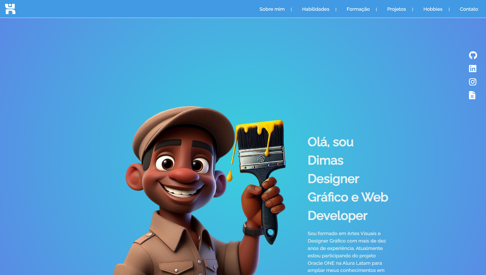

# Portfólio Dimas



## Sobre o Projeto

Este portfólio foi desenvolvido para apresentar as habilidades, projetos e experiências do **Dimas**, que atua como Designer Gráfico e Web Developer. Nele, você encontrará:

- **Seção de Apresentação**: Uma breve introdução sobre o perfil profissional de Dimas.
- **Seção Sobre Mim**: Informações sobre a formação em Artes Visuais, atuação no Corpo de Bombeiros Militar de Mato Grosso do Sul e vivências na área de design.
- **Seção de Habilidades**: Competências na área de Desenvolvimento Web (HTML, CSS, JavaScript, React) e em Design Gráfico (Photoshop, Illustrator, UI/UX, 3D).
- **Seção de Hobbies**: Atividades preferidas que mostram um pouco da personalidade e interesses.
- **Seção de Formação**: Instituições e cursos concluídos para embasar o conhecimento adquirido.
- **Seção de Projetos**: Galerias de criações em Design Gráfico, Ilustração e Desenvolvimento Web.
- **Seção de Contato**: Formulário simples para entrar em contato direto.

## Tecnologias Utilizadas

- **HTML5** e **CSS3** para a estrutura e estilização das páginas;
- **JavaScript** para adicionar interatividade e funcionalidades;
- **Font Awesome** para ícones;
- **Snap.svg** (biblioteca JavaScript) em conjunto com **jQuery** (em alguns trechos);
- **Git** e **GitHub** para versionamento de código.

## Como Executar o Projeto

1. **Clone** este repositório em seu ambiente local:
   ```bash
   git clone https://github.com/SEU-USUARIO/seu-repositorio.git
